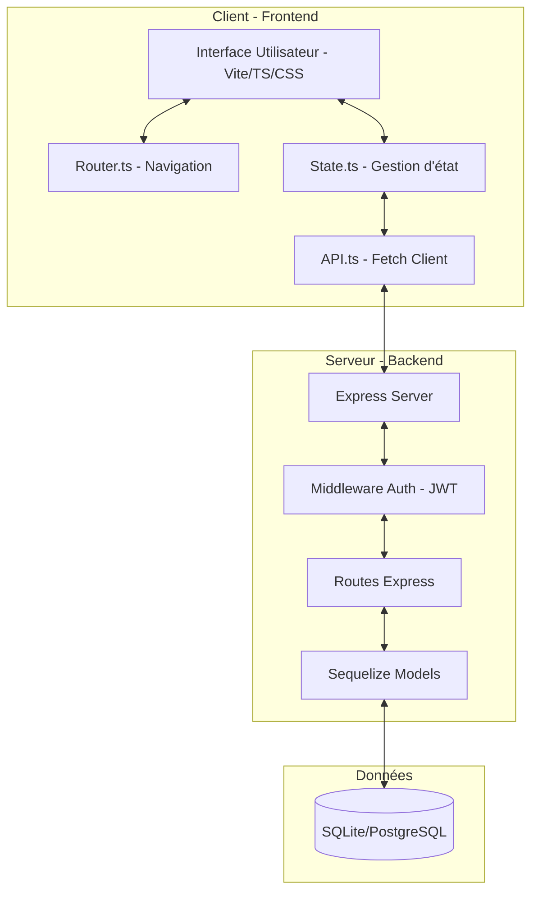
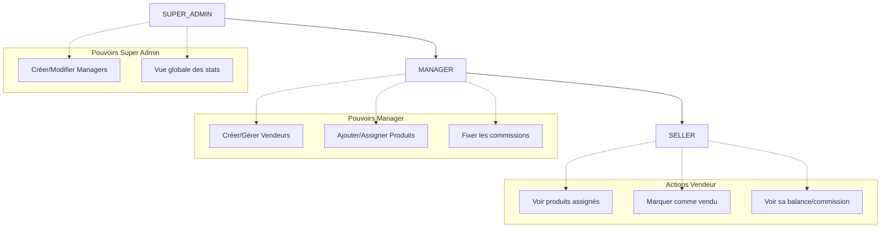
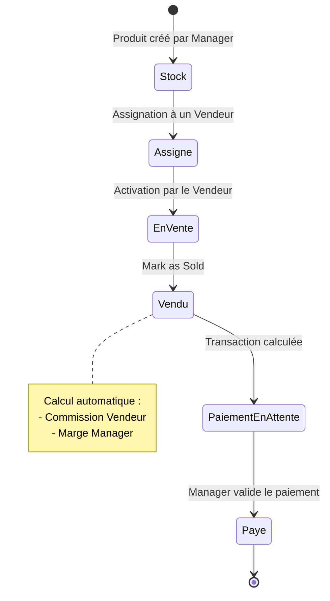
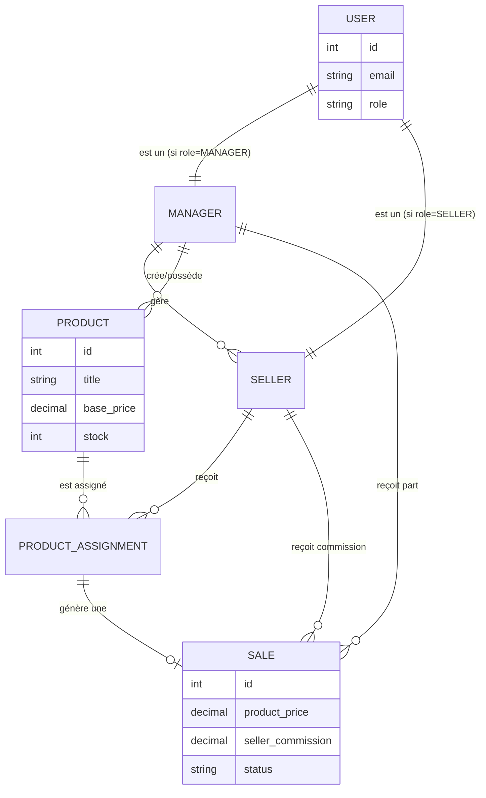

# Architecture de l'Application Seller Gest

Ce document décrit le fonctionnement technique et fonctionnel de l'application via des schémas Mermaid.

## 1. Architecture Système

L'application suit une architecture Client-Serveur classique.

---

## 2. Hiérarchie des Rôles

La gestion des utilisateurs est basée sur trois niveaux de privilèges.

---

## 3. Flux Logique d'une Vente

Cheminement d'un produit depuis son ajout jusqu'à la rémunération.

---

## 4. Modèle de Données (ER Simplified)

Relations entre les principales entités de la base de données.

